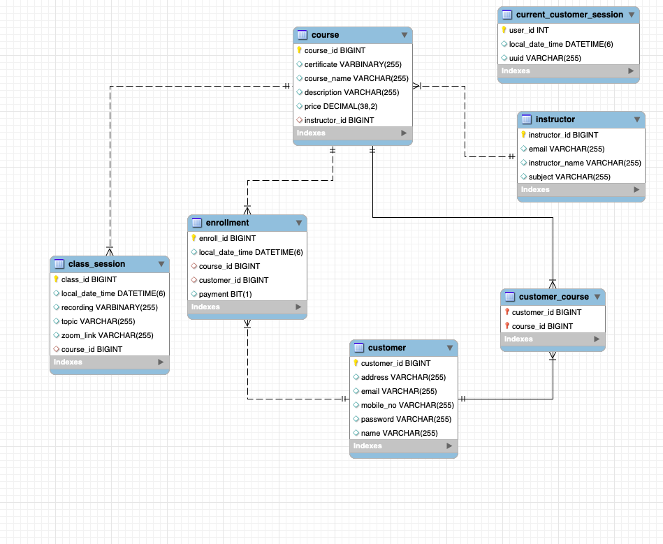

# GrowSkill - E-Learning Platform

GrowSkill is an e-learning platform designed to offer a wide range of paid online courses in Baking, Makeup, and Handicrafts. It provides users with the opportunity to enhance their skills and knowledge through live classes conducted by specialized instructors.

## Name: Bhoop Singh
## Email: bhoopsinghyadav26@gmail.com
## Github:https://github.com/bhupirao
## LinkedIn:linkedin.com/in/bhoopsingh26/
# ER Diagram

## Features
- **used basic crud operation
- **Course
- **Class Session
- ** Customer
- **Instructor
- **User Authentication:** Secure login and registration system for users.

## Technologies Used
- Java
- Spring Boot
- Simple Security
- Hibernate/JPA
- MySQL
- Maven
- Git 

## Getting Started
Access the application in your browser at `http://localhost:8080`

## Contributors
- [Bhoop Singh](https://github.com/bhupirao)
